# ArenadataDB adb_fdw connector

#### Введение

- В этой статье рассматривается детали предлагаемой нами реализации коннектора для выполнения, так называемых, гетерогенных запросов в рамках одного кластера ArenadataDB и/или Greenplum. Этот коннектор позволяет объединять в запросах не только разные кластеры ADB, а и разные базы в рамках одного кластера, но при этом пользоваться возможностями установления соединений между сегментами.

#### Существующие подходы и решения

Суть предоставления возможности выполнения гетерогенных запросов - дать пользователю инструментарий осуществлять доступ к данным так, чтобы с точки зрения использования данных создавалось впечатление, будто бы они размещены в той же системе управления данными. При чем делать это по возможности максимально эффективно и прозрачно.

- Какой же инструментарий есть в нашем распоряжении?

##### Platform Extension Framework (PXF)

Первое, что приходит на ум - это распространенный среди пользователей PXF-сервис, фреймворк для объединения разных источников данных.

- К достоинствами можно отнести:

1. Проверенное временем решение на базе открытого исходного кода c возможностью доработки под свои потребности.
2. Доступный "из коробки" набор коннекторов к популярным источникам данных (Hadoop стек, доступные через JDBC источники данных, облачные хранилища).
3. Возможность настройки мониторинга.

- Но можно выделить и ряд недостатков:

1. Необходимость поддерживать обособленное решение на базе своего стека.
2. Выделение ресурсов, как правило, на тех же серверах, где и развернута сама СУБД.
3. Множественное преобразование и перекладывание одних и тех же данных на пути от представления в СУБД к типам, которыми оперирует сам PXF.

#### Расширение postgres\_fdw

Расширение `postgres_fdw` - фундамент, можно сказать источник вдохновения многих других существующих коннекторов.
Коннектор физически представляет собой расширения PostgreSQL, в случае Greenplum устанавливаемый на мастер хост.
Изначально расширение ориентировано на работу с удаленным PostgreSQL, но в рамках апстрима Greenplum доработано на работу в рамках распределенной СУБД. Взаимодействие организовано через стандартный протокол и библиотеку libpq, так что это позволяет прозрачно работать и с Greenplum (разумеется в стиле master-master).

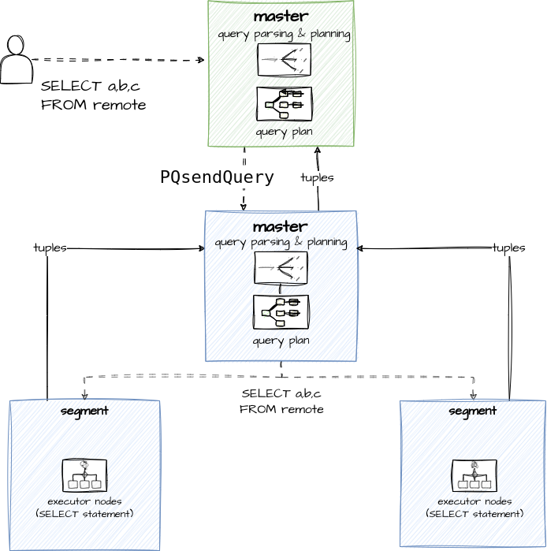

- На схеме выше локальный кластер (обозначенный синим цветом) представлен мастером и парой сегментов, удаленный кластер - мастер (обозначенный зеленым).

Для `SELECT` запроса схематично процесс взаимодействия выглядит примерно так:

1. Пользователь формирует `SELECT` запрос.
2. Запрос проходит стандартные этапы парсинга, анализа и планирования.
3. Расширение устанавливает соединение с удаленным мастером, открывает транзакцию и отправляет запрос (с учетом некоторых нюансов, что не все условия к примеру можно отправить на удаленный кластер).
4. Далее обрабатывается ответ и либо он возвращаетя пользователю, или, в случае более сложных запросов, результат обрабатывается как-то иначе.

Отличительной особенностью этой схемы является работа в стиле мастер-мастер. Сегменты в этом случае никак не задействованы.

В случае `INSERT` запросов всё также идёт через мастера, но задействуется механизм prepared выражений:


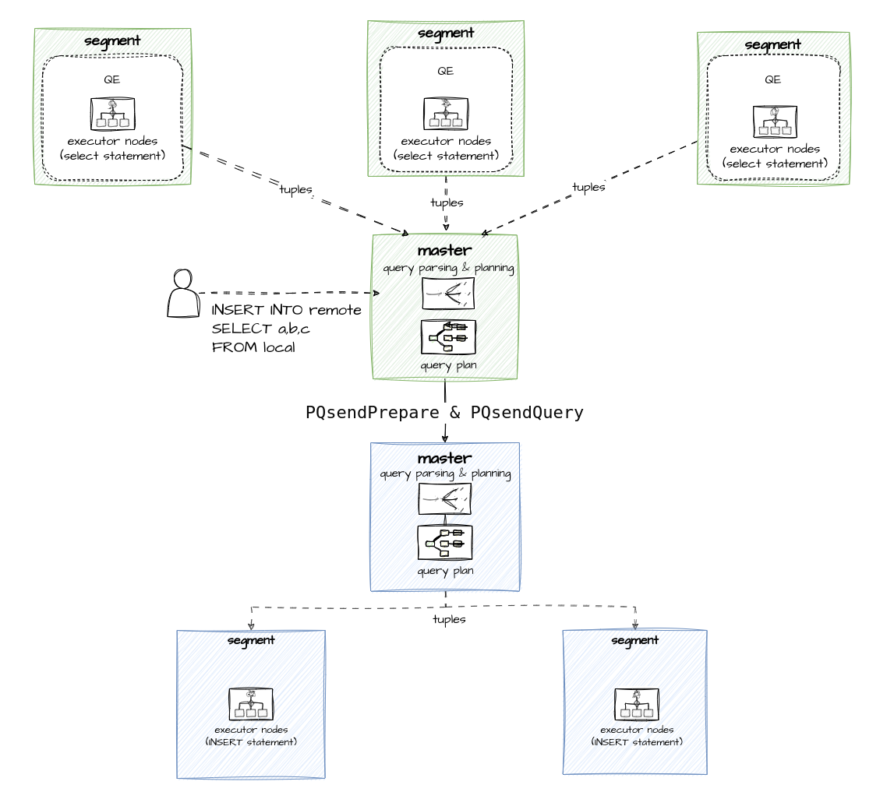

- В чем плюсы для тех, кто решит воспользоваться для организации связи кластера расширением `postgres_fdw`:

1. Решение с открытым исходным кодом - собрал и поставил.
2. Работа в стиле мастер-мастер стабильна. Далее я поясню на примере `greenplum_fdw`, что под этим понимается.
3. Свежие версии коннектора, которые поддерживают новый интерфейс FDW умеют частично поддерживать push-down более сложных конструкций в виде соединений и т.п. Этой теме я уделю время в конце статьи.

- При этом есть очевидные минусы:

1. Поддержка параллельной работы отсутствует.
2. Если попробовать вызвать `DELETE` или `UPDATE` для таблицы на удаленном кластере, то коннектор будет возвращать ошибки.

##### Расширение greenplum\_fdw

От `postgres_fdw` перейдём к тяжелой артиллерии - к `greemplum_fdw`, входящем в платную enterprise версию Greenplum.  
И тут я хочу отметить, что в деле удалось поисследовать только бета версию, и, возможно, какие-то проблемы присущие бете были исправлены в последующих версиях.

 Что же не так с `greenplum_fdw`?

- Первое неудобство - это жестокое задание количества обработчиков. Допустим локальный кластер развернут на трёх primary-сегментах:

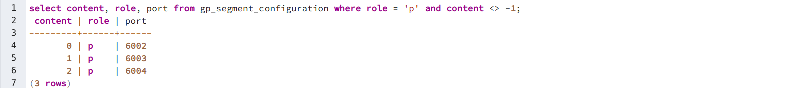

- Допустим, удаленный Greenplum кластер при этом не совпадает по количеству сегментов - там их четыре.

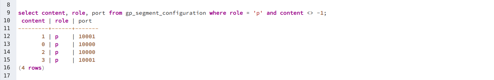

------------------------------------------


- Если при объявлении внешней таблице на локальном кластере не задать нужно количество обработчиков (либо задать его таким числом, которое не совпадает с числом ремоут кластера), то запрос завершается ошибкой.

- Задать нужное количество обработчиков - проблема сама по себе не такая большая. Хотя запрашивать у владельцев другого кластера эту информацию не всегда может быть удобным. Хуже, что если конфигурация кластера поменяется, то запросы работать перестанут до момента, когда на локальном кластер не будет сделан `ALTER SERVER` и переконфигурирован на нужное число.


Более неприятная ситуация может возникнуть в случае, если мы захотим перенести какие-то данные с локального кластера на удаленный путём вставки в foreign таблицу.

- Допустим на локальном кластере есть таблица в которой 1100 записей.


- Для такого запроса вставки в foreign таблицу планировщик создаст примерно такой план, в котором внизу лежит `Seq Scan` узел плана (последовательное чтение данных из таблицы), который получает данные локальной таблицы. Далее делается `Redistribute Motion` данных между сегментами, далее идёт вставка с каждого сегмента по отдельности:

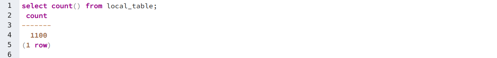


---------------------------

- В целях эксперимента добавим отображение шага коммита транзакции на уровне сегментов:


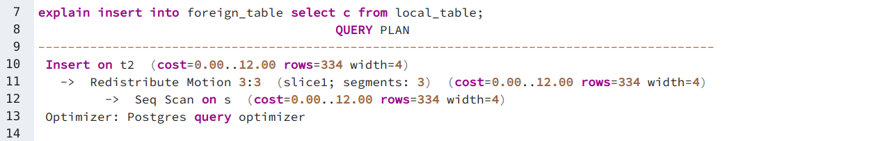
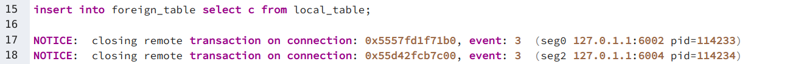

-----------------

- Как мы видим с двух сегментов базе данных удалось закоммиттить транзакцию, но с третьей произошла некая ошибочная ситуация:


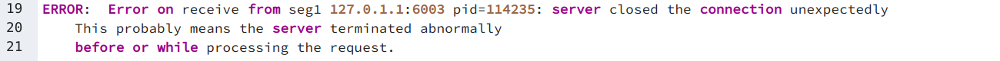

- В то время как мы делали один `INSERT` который по ожиданиям пользователя реляционной СУБД с поддержкой ACID должен быть атомарным, мы получаем 742 записи в удаленной таблице:

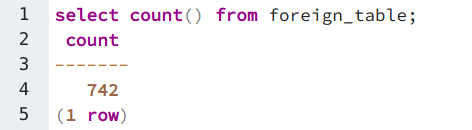


Предлагаю разобраться в чем причина такой ситуации.

- Смоделируем её следующим образом. Допустим у нас есть локальный кластер из трёх сегментов + мастер и удаленный кластер мастер и два сегмента.

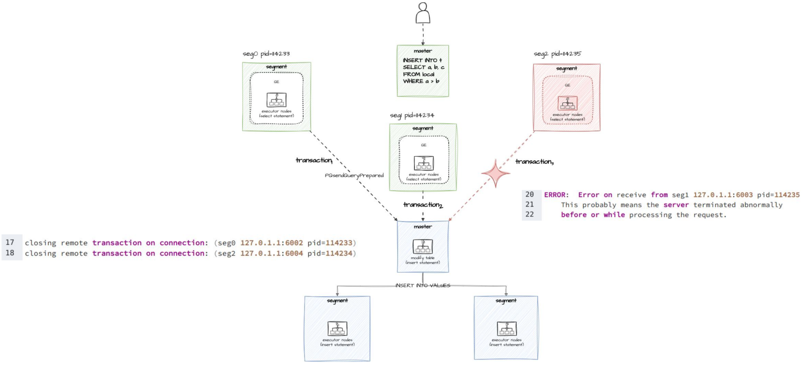

1. От пользователя приходит `INSERT` запрос .
2. Он проходит стадии обработки запроса и устанавливает соединения и открывает отдельные транзакции с сегментов.
3. Эти транзакции работают с мастером на удаленном кластере.

Тут важно понимать, что такая схема заложена в архитектуру `postgres_fdw`, который поддерживает пул соединений, в рамках которых при установлении соединения открывается транзакция. Она же и коммитится по отдельности не имея информации о статусе соседних. И в какой-то момент одна из них отваливается - мы получаем приведенный выше результат.

Как итоги, к достоинствам бета версии `greenplum_fdw` можно отнести поддержку `SELECT` в MPP-стиле, но возможные проблемы с консистентностью данных при вставке ставят под сомнения возможность использования коннектора как двунаправленного.

При этом у пользователя нет возможности управлять этими рисками - выбрав для вставки стратегию мастер к мастеру, так как в этом случае для `SELECT` запросов также будет такая же стратегию.

Да и `SELECT` запросы довольно жестко привязаны к конфигурациям по числу сегментов.

Ну и формальный минус, что по сравнению с `postgres_fdw` этот коннектор только в enterprise версии.

#### Parallel Retrieve Cursors

Для понимания внутреннего устройства `adb_fdw` коннектора нужно рассмотреть лежащий в его основе механизм параллельных курсоров. Курсоры, как известно, используются для получения данных построчно, в процедурном стиле. Параллельные курсоры в этом плане ничем не отличаются от своих собратьев. Они объявляются на координаторе запросов (в терминах Greenplum - `GP_ROLE_DISPATCH`), однако эндпоинты (о них далее) создаются на сегментах. Их размещение зависит от запроса, вернее от результата его планирования. Еще важно добавить, что для обслуживания эндпоинта - той точки, через которую происходит обмен данными, поднимается отдельный процесс бэкенда.

Рассмотрим три простых примера объявления параллельного курсора, которые приводят к разным конфигурациям размещения эндпоинтов.

##### Получения данных с мастера

К такой конфигурации эндпоинтов приводит необходимость собрать данные на мастере, например, как в данном случае для их сортировки:

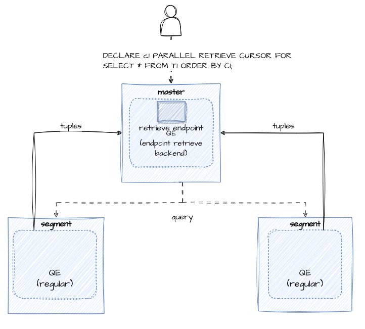

##### Получения данных с одного из сегментов

- Второй вариант - это получения данных от какого-то одного сегмента. Например, в случае если планировщик определяет, что в соответствии с ключом дистрибуции нужно задиспатчить план на какой-то определенный сегмент:

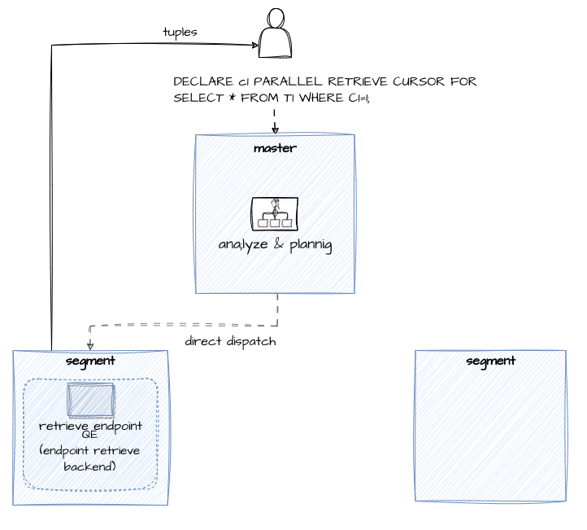

##### Получения данных от всех сегментов

- и третий случай - это получения данных от всех сегментов. Например, получение всех колонок, без какой-либо фильтрации `WHERE` условиями . Эндоинты поднимаются на каждом сегменте и данные могут быть возвращены напрямую с сегментов:

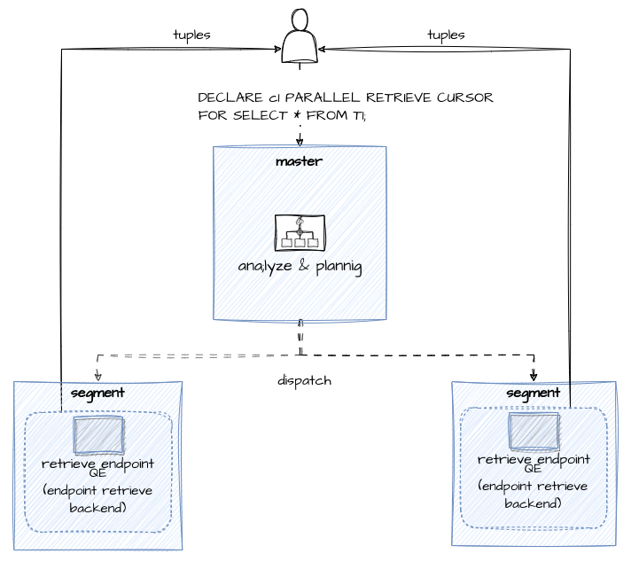

- Чуть подробнее погрузимся в механику процесса эндопоинтов на сегментах. Допустим у нас есть пользовательская сессия, в рамках которой на мастер пришел запрос. Он проходит обычную стадию парсинга и планирования:

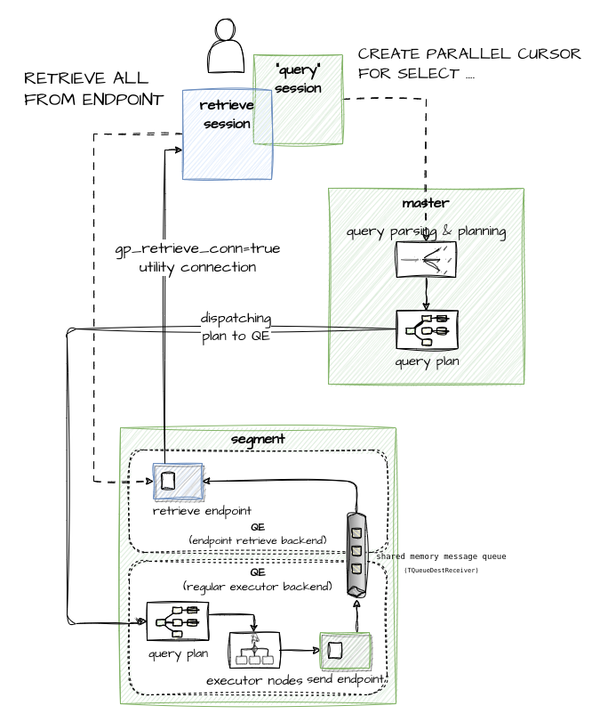

Далее план или какая-то часть плана диспетчеризируется на сегмент и обрабатывается в рамках процесса бэкенда.

В нашем случае, так как это запрос на создание параллельного курсора для лежащего в его основе `SELECT` запроса, то далее бэкенд создаёт необходимую обвязку для обслуживания канала получения данных клиентом.

Для этого помимо всего прочего в общей памяти поднимается очередь сообщений для обмена данным с тем самым отдельным процессом бэкенда, который используется клиентом для получения данных. С этой целью клиент поднимает отдельного, специальное `utility` соединение, в рамках которого допускается только извлечение данных параллельного курсора. На схеме выше этот соединение обозначено настройкой `gp_retrieve_conn = true`

***Именно этот механизм лежит в основе в `adb_fdw` коннектора.***

##### Коннектор ADB-to-ADB (adb\_fdw)

Для созданиях конкуретных преимуществ на текущем этапе развития нашем `adb_fdw` коннекторе были релизованы некоторые альтернативные технические решения.

Для начала посмотрим на него с пользовательской точки зрения.

Точкой входа во внешний кластер выступает определение `SERVER` - это мастер удаленного кластера. Ключевое слово `mpp_execute` заданное как `master` не означает, что все преимущества MPP для выполнения `SELECT` запросов сведены на нет. Наш коннектор сам определяет нужную конфигурацию обработчиков. Значение master необходимо, чтобы вставка работала только в режиме master - master.

Также можно задать число обработчиков, либо запросить коннектор самостоятельно определять число обработчиков на основе планирования запроса на удаленного кластере. Что является довольно удобным.

Далее, как обычно (для FDW-коннекторов) задаётся пользовательский маппинг и объявляется внешняя таблица:

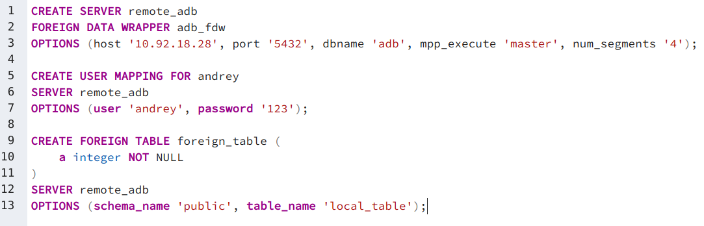

В чем особенности работы нашего коннектора?

##### SELECT запросы

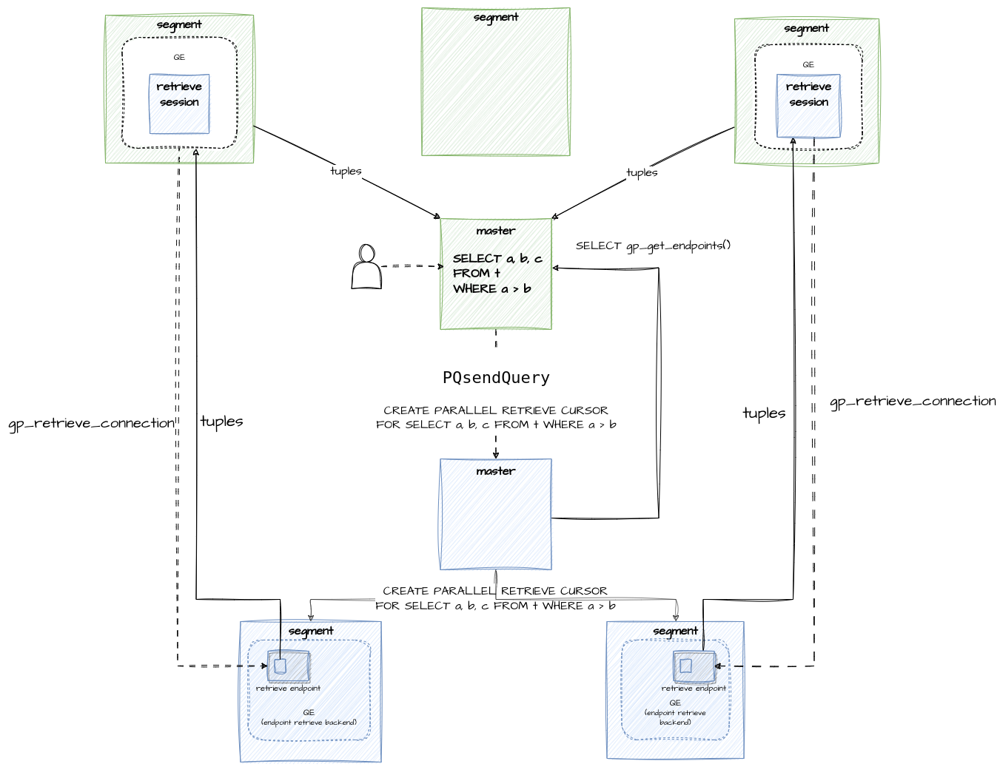


- Всё та же конфигурация кластера: три локальных сегмента и два удаленных. Пользователь делает запрос на `SELECT` трёх колонок без фильтров. Запрос в виде создания параллельного курсора прилетает на удаленный мастер. Далее удаленный мастер создаёт эндопоинты и возвращает локальному мастеру при вызове им функции `gp_get_endpoints()` служебную информацию по этим эндпоинтам.

- Далее, так как мы получили информацию, что эндпоинтов два, то нам будет достаточно двух обработчиков, которые и поднимаются в виде процессов бэкендов на локальном кластере (белые прямоугольники внутри зеленых на схеме выше). Сегменты поднимают служебное соединение - так называемую `retrieve` сессию и начинают параллельно получать данные напрямую с сегментов, отдавая их мастеру, так как в нашем случае этого требует запрос.

##### INSERT запросы

- На текущий момент не существует реализации надежного механизма обеспечить целостность вставки в режиме параллельной работы коннектора. В будущих версиях ядра можно ожидать такую поддержку, но готового механизма всё еще нет.


В нашем коннекторе целостность поставлена во главу угла и поддерживается вставка в стиле `postgres_fdw` в режиме мастер-мастер.

#### Дальнейшие планы

В свежих версиях PostgreSQL и, как следствие, в Greenplum 7 интерфейс доступа к внешним источникам данных FDW расширился как несколькими новыми функциями, так и новыми параметрами существующих функций.

Суть эти изменений в предоставлении возможности поддержки push-down как соединений, так и агрегатных функций. Это выводит подобные коннекторы на новый уровень в плане возможности строить более оптимальные планы, сокращать объемы передаваемых данных и, в целом, ускорять выполнение запросов.

Рассмотрение этой интересной и объемной темы - предмет отдельной статьи. Сейчас хочется вкратце затронуть тему сложностей и подводных камней этих ожидаемых фич, которые мы планируем реализовать в следующих версиях конектора в рамках Arenadata DB версии 7x.

##### Ограничения предикатов

Не все предикаты можно передать на удаленный кластер. Есть ограничения по возможности передачи выражения с заданными правилами сортировки (`COLLATION`). Мотивацией такого типа ограничений связана с тем, что на удаленном кластере нельзя рассчитывать на такое же окружение, чтобы правила сортировки не по умолчанию сработали именно так, как на локальном кластере.

При явно заданных правилах сортировки (т.е. отличных от default collation с `OID = 100`) для отправки на удаленный кластер допускаются только выражения, которые связаны с объявленимя для внешней таблицы (foreign table). Таким образом, если правило сортировки для колонки явно задано при объявлении внешней таблицы, то это условие считается безопасным к отправке условием. Напротив, если для выражения выводится некоторое правило сортировки, отличное от default, то это считается не безопасным и обрабатывается локально. Например, для данного выражения сравнения колонки внешней таблицы с константой, для которой задано правило сортировки, фильтр применяется локально, уже после вычитывания всей таблицы:

```sql
adb=# explain select count(c1) from foreign_table as ft where ft.c1 like 'foo' COLLATE "POSIX";
                            QUERY PLAN                             
-------------------------------------------------------------------
 Aggregate  (cost=3897.97..3897.98 rows=1 width=8)
   ->  Foreign Scan on ft  (cost=100.00..3897.72 rows=100 width=16)
         Filter: (c1 ~~ 'foo'::text COLLATE "POSIX")
 Optimizer: Postgres-based planner
(4 rows)
```

В случае выведения правила по умолчанию происходит push-down на удаленный кластер:

```sql
adb=# explain select count(ft.c1) from foreign_table ft where ft.c1 like 'foo';
                      QUERY PLAN                      
------------------------------------------------------
 Foreign Scan  (cost=1894.20..1894.23 rows=1 width=8)
   Relations: Aggregate on (public.ft)
 Optimizer: Postgres-based planner
(3 rows)

```

Также не допускаются к отправке на удаленный кластер выражения с волатильными функциями (`VOLATILE`). Простейший пример функции `random()` или `now()`. Для таких запросов условие обрабатывается локально:

```sql
adb=# explain select * from foreign_table as ft where ft.c1 >= random();
                          QUERY PLAN                           
---------------------------------------------------------------
 Foreign Scan on ft  (cost=100.00..4398.60 rows=33392 width=16)
   Filter: ((c1)::double precision >= random())
 Optimizer: Postgres-based planner
```

##### Joins push-down

Возможность передать задачу соединения таблиц во внешний кластер (так называемый `join push-down`), если они фигурируют в запросе выглядит крайне полезной. Для начала по основным ограничениям:

1. Базовое требований - таблицы должны быть связаны с одним и тем же внешним сервером (имеется ввиду описание `SERVER`).
2. Join push-down на текущий момент поддерживается только для внутренних (`JOIN_INNER`), левых и правых внешних соединений (`JOIN_LEFT`, `JOIN_RIGHT`), а также полный соединений (`JOIN_FULL`). Дальнейшее развитие предполагает `SEMI-` и `ANTI-` соединения для поддержки SQL-конструкций вида `NOT IN` и `ANY`.
3. Внутренняя и внешняя таблицы соединения должны позволять передавать предикаты соединения, предикаты-фильтры выборки во внешний кластер. Если предикат не может беыть передан во внешний кластер, то push-down не возможен. Например:

```sql
adb=# explain select count(*) from ft_a inner join ft_b on ft_a.id = ft_b.id where ft_a.ts >= current_date::timestamp;
                          QUERY PLAN                          
--------------------------------------------------------------
 Foreign Scan  (cost=350.53..350.56 rows=1 width=8)
   Relations: Aggregate on ((public.ft_a) INNER JOIN (public.ft_b))
 Optimizer: Postgres-based planner
(3 rows)

```

В данном случае выражение `ft_a.ts >= current_date::timestamp` может быть преобразовано в константу, передано в таком виде на удаленный кластер и выступать условием выборки.

Однако, в случае такого запроса условие `ft_a.ts >= current_timestamp` не может быть передано, так как функция `current_timestamp` не является `IMMUTABLE` (а точнее является `STABLE`). Что приводит к двум отдельным `Foreign Scan` и локальному соединению и применениям условия (`Filter`):

```sql
adb=# explain select count(*) from ft_a inner join ft_b on ft_a.id = ft_b.id where ft_a.ts >= current_timestamp;
                                       QUERY PLAN                                        
-----------------------------------------------------------------------------------------
 Aggregate  (cost=664.92..664.93 rows=1 width=8)
   ->  Hash Join  (cost=239.04..658.24 rows=2670 width=0)
         Hash Cond: (ft_a.id = ft_b.id)
         ->  Foreign Scan on ft_a  (cost=100.00..480.00 rows=3333 width=12)
               Filter: (ts >= '2024-04-07 16:49:38.585287+03'::timestamp with time zone)
         ->  Hash  (cost=129.03..129.03 rows=801 width=4)
               ->  Foreign Scan on ft_b  (cost=100.00..129.03 rows=801 width=4)
 Optimizer: Postgres-based planner
(8 rows)

```

##### Aggregates push-down

- Для того, чтобы агрегатная функция могла быть передана для выполнения на удалённом кластере, должно выполняться несколько условий:

- Если в выборке используется предикат, который не может быть отправлен на удаленный кластер, то такая агрегация может быть осуществлена только локально, так условие предиката должно быть применено только в процессе выборки, а не после. Например, условие `ft_a.id >= random()` не позволяет сделать push down агрегатной функции `count(*)`, в то время как `ft_a.ts >= current_date::timestamp` позволяет: 
```sql
    adb=# explain select ft_a.name, count(*) from ft_a where ft_a.ts >= current_date::timestamp group by ft_a.name;
                         QUERY PLAN                      
    -----------------------------------------------------
     Foreign Scan  (cost=330.00..330.03 rows=1 width=40)
       Relations: Aggregate on (public.ft_a)
     Optimizer: Postgres-based planner
    (3 rows)
    
    adb=# explain select ft_a.name, count(*) from ft_a where ft_a.id >= random() group by ft_a.name;
                                 QUERY PLAN                              
    ---------------------------------------------------------------------
     HashAggregate  (cost=546.67..556.67 rows=1000 width=40)
       Group Key: name
       ->  Foreign Scan on ft_a  (cost=100.00..530.00 rows=3333 width=8)
             Filter: ((id)::double precision >= random())
     Optimizer: Postgres-based planner
    (5 rows)
```
- Это должна быть либо простая агрегатная функция, например `count`, `min`, `max` и т.п., либо функция, поддерживающая частичную (partial aggregation). Также, с точки зрения контекста выполнения функции частичной агрерации это должна быть начальная фазы частичной агрегации.
- Для второго случая частичной агрегации должны выполняться условия: 
    - агрегатная функция не должна быть сортирующей (Ordered-Set Aggregate Functions не поддерживаются). В эту категорию попадают процентили (percentile), так как для их вычисления требуется упорядоченный набор значений;
    - для агрегатной функции должно отсутствовать определение финальной функции (`aggfinalfn`), и таким образом её применение не потребует фазы вычисления результирующего значения;
    - если все-таки `aggfinalfn` объявлена вместе с функцией `aggcombinefn`, то поддерживается только определенный набор таких функций (в основном это вариации `avg` и `sum`).
- Также, не поддерживаются выражения c `GROUPING SETS`.

В чем же смысл подобных ограничений? Для распределенных СУБД вычисление простых агрегатов не представляет особых сложностей. Отдельные значения можно подсчитать на сегментах и в результирующей функции произвести финальный подсчёт. Несложно прикинуть такое разбиение на подзадачи для `min`, `max`, `count` и т.п. функций.

С фукнцией `avg` уже интереснее - для `avg` при возврате данных от сегмента помимо вычисленного среднего значения требуется и общее число строк, для которых это среднее было рассчитано. Только так финальная функция сможет рассчитать итоговое значение. По этой причине `avg` может быть диспетчеризирована на сегменты в виде "`array[count(), sum()]`" выражения (для чисел с плавающей точкой выражение выглядит чуть сложнее).

##### Итоги

По сравнению конкурирующими решениями у коннектора `adb_fdw` есть ряд преимуществ, которые выгодно отличают его от рассмотренных альтернатив:

1. Также, как и `greenplum_fdw` наше решение поддерживает параллельную работу через сегменты в `SELECT` запросах, там где запросы это позволяют делать, но делает это в более удобном для пользователя варианте - отсутствует необходимость отслеживать число обработчиков.
2. Взаимодействие master-master при `INSERT` запросах позволяет нам не натыкаться на те проблемы целостности данных, которые могут встречаться в `greenplum_fdw`.
3. Также в `adb-fdw` более аккуратно обрабатывается ситуация с отсутствием на текущий момент поддержки `DELETE` и `UPDATE` запросов.

Внедрение поддержи push-down функций агрегатов и соединений в следующей версии коннектора `adb_fdw` еще больше расширит области его применения, сократит объемы передаваемых данных и увеличит скорость взаимодействия в наиболее распространенных сценариях использования.


###### ===================================================================
###### ---------------------------подготовка к тестированию adb_tdw-----------------------------------  
###### ===================================================================
##### фактура:

- создано 10 баз test0..test10 
создано по 10 таблиц в каждой базе, одинаковой стрктуры.
все таблицы заполнены одниковым количеством строк 10млн тестовыми данными, на 2.9гб каждая база
созданы в каждой из 9 баз по 10 FOREIGN tables:
создан а каждой базе 1 SERVER test_0_fdw

```sql
CREATE TABLE test.table_1 ...test.table_10 (
	id serial4 NOT NULL,
	field1 text NULL,
	field2 text NULL,
	field3 text NULL,
	field4 text NULL,
	field5 text NULL,
	field6 text NULL,
	field7 text NULL,
	field8 text NULL,
	field9 text NULL,
	field10 text NULL,
	field11 text NULL,
	field12 text NULL,
	field13 text NULL,
	field14 text NULL,
	field15 text NULL,
	CONSTRAINT table_1_pkey PRIMARY KEY (id)
)
DISTRIBUTED BY (id);
```
-- 
```sql
CREATE SERVER test_0_fdw
FOREIGN DATA WRAPPER adb_fdw
OPTIONS (
  host 'ndp-v01dgl-dm',
  port '5432',
  dbname 'test_0',
  use_remote_estimate 'true');    
```
--    
```sql
CREATE USER MAPPING FOR adb_to_adb
SERVER test_0_fdw
OPTIONS (user 'adb_to_adb', password 'adb_to_adb');    
```
--
```sql
CREATE FOREIGN table if not exists test.test_0_test_1_rpdc .. test.test_0_test_10_rpdc ( id int,
	field1 text NULL,
	field2 text NULL,
	field3 text NULL,
	field4 text NULL,
	field5 text NULL,
	field6 text NULL,
	field7 text NULL,
	field8 text NULL,
	field9 text NULL,
	field10 text NULL,
	field11 text NULL,
	field12 text NULL,
	field13 text NULL,
	field14 text NULL,
	field15 text NULL)
SERVER test_0_fdw
OPTIONS (schema_name 'test', table_name 'table_1 .. table_10'); 
```
###### ===================================================================
###### --------------------тестирование adb_tdw----------------------------------------------------------------
###### ===================================================================

- соедиение по ключу в одной базе с разными таблицами однаковой стуктуры и размера в 2.9Gb
```sql
explain analyze
select
	count()
from
	test.table_1 t1
join test.table_2 t2 on
	t1.id = t2.id ;
```
- результат:
```
count   |
--------+
10000000|
```
- фактическое время выполнения: 1 строк получено - 327ms, 2024-07-17 в 13:10:19

```
/*
QUERY PLAN                                                                                                                                |
------------------------------------------------------------------------------------------------------------------------------------------+
Aggregate  (cost=0.00..1034.53 rows=1 width=8) (actual time=321.476..321.476 rows=1 loops=1)                                              |
  ->  Gather Motion 40:1  (slice1; segments: 40)  (cost=0.00..1034.53 rows=1 width=8) (actual time=290.623..321.432 rows=40 loops=1)      |
        ->  Aggregate  (cost=0.00..1034.53 rows=1 width=8) (actual time=297.772..297.772 rows=1 loops=1)                                  |
              ->  Hash Join  (cost=0.00..1034.53 rows=249974 width=1) (actual time=157.662..300.742 rows=251309 loops=1)                  |
                    Hash Cond: (table_1.id = table_2.id)                                                                                  |
                    Extra Text: (seg12)  Hash chain length 1.0 avg, 3 max, using 247227 of 8388608 buckets.                               |
                    ->  Seq Scan on table_1  (cost=0.00..469.09 rows=250045 width=4) (actual time=0.054..45.782 rows=251309 loops=1)      |
                    ->  Hash  (cost=469.08..469.08 rows=249974 width=4) (actual time=122.549..122.549 rows=251309 loops=1)                |
                          ->  Seq Scan on table_2  (cost=0.00..469.08 rows=249974 width=4) (actual time=0.062..53.335 rows=251309 loops=1)|
Planning time: 11.180 ms                                                                                                                  |
  (slice0)    Executor memory: 131K bytes.                                                                                                |
  (slice1)    Executor memory: 81978K bytes avg x 40 workers, 81978K bytes max (seg0).  Work_mem: 5891K bytes max.                        |
Memory used:  1441792kB                                                                                                                   |
Optimizer: Pivotal Optimizer (GPORCA)                                                                                                     |
Execution time: 323.226 ms                                                                                                                |
*/
```

- запрос в одной базе для примера
```sql
explain analyze
select
	*
from
	test.table_1 t1
join test.table_2 t2 on
	t1.id = t2.id ;
```

- результат:
```
id  |field1   |field2   |field3   |field4   |field5   |field6   |field7   |field8   |field9   |field10  |field11  |field12  |field13                         |field14                         |field15                         |id  |field1   |field2   |field3   |field4   |field5   |field6   |field7   |field8   |field9   |field10  |field11  |field12  |field13                         |field14                         |field15                         |
----+---------+---------+---------+---------+---------+---------+---------+---------+---------+---------+---------+---------+--------------------------------+--------------------------------+--------------------------------+----+---------+---------+---------+---------+---------+---------+---------+---------+---------+---------+---------+---------+--------------------------------+--------------------------------+--------------------------------+
   9|value9   |value9   |value9   |value9   |value9   |value9   |value9   |value9   |value9   |value9   |value9   |value9   |49ce8c5c225812b036bca93393348213|8acc7d68040a0f7f0999c05bc5ed9fa4|ff975b6f382a0926003e19140393a2d8|   9|value9   |value9   |value9   |value9   |value9   |value9   |value9   |value9   |value9   |value9   |value9   |value9   |613eb2e979da178096b23cbba775a804|2d072a6ceb1bb6c4f84668cc4b0b5aa2|8a145e934b13b988eb889d1cb52786a0|
  10|value10  |value10  |value10  |value10  |value10  |value10  |value10  |value10  |value10  |value10  |value10  |value10  |a00c11a804585716ab0e0004fdab82cc|aac0d2ae7c468c21392ed811418fb505|99e7768a38b678051537e053e4eb656e|  10|value10  |value10  |value10  |value10  |value10  |value10  |value10  |value10  |value10  |value10  |value10  |value10  |03af18c0ea2668c837ded055c50667b2|9d26d2f0fe408fa166663571919a76dc|e085ddafaba3a1491d14c135abd9bf5e|
  47|value47  |value47  |value47  |value47  |value47  |value47  |value47  |value47  |value47  |value47  |value47  |value47  |bee11b9536a0479530b22ee7a876c9b6|5e93c4a1d1ecdd0a4d76255313e333a4|9f10afce95b9e8b6df038d6336d7687b|  47|value47  |value47  |value47  |value47  |value47  |value47  |value47  |value47  |value47  |value47  |value47  |value47  |12c79f0d074bfe8ef75a6fa60ed86d7a|04003da5da43d2fb688f23fe098faa29|fde855035d2e069df55de0d90234fc14|
  69|value69  |value69  |value69  |value69  |value69  |value69  |value69  |value69  |value69  |value69  |value69  |value69  |faaa8f96654a25c991e39c62c80f98e0|d0540a2dc1588ad269a12f3be43bc1c9|70782cea150e831906f66fc6b43504f3|  69|value69  |value69  |value69  |value69  |value69  |value69  |value69  |value69  |value69  |value69  |value69  |value69  |16428aad8f1a466d3965271d44d83197|2b2cd9b312f8050e9f39dd455b0ba8f2|cc2b7a0df7a5c964cba0539857e6f6e3|
 129|value129 |value129 |value129 |value129 |value129 |value129 |value129 |value129 |value129 |value129 |value129 |value129 |840f4d5b3c436e32445d864b81361a8d|f7aa56318e1f171277bc7269afd46f4f|d7c924399a6314c9bb7d3ed373dc0f14| 129|value129 |value129 |value129 |value129 |value129 |value129 |value129 |value129 |value129 |value129 |value129 |value129 |f0be4f2d3c9d03c9407f118b5e387eec|c3445183d9f3c26ede24a5a81f7b42bf|23d1eeed56d95a5a2ab08d462e141651|
 290|value290 |value290 |value290 |value290 |value290 |value290 |value290 |value290 |value290 |value290 |value290 |value290 |67ab630068fe99368ebafb6aa1aa3a57|0d5fb8ceba19f0d9e56f61fb9181dc2c|a166022c60e1dac8b6c656441aeb3f3d| 290|value290 |value290 |value290 |value290 |value290 |value290 |value290 |value290 |value290 |value290 |value290 |value290 |046c200cee0ab5df72d30187e4d98d0b|aac8d5d640896cc018ff748d633a19e5|9e95f3a550a1c9661b8beb6793fedb95|
 363|value363 |value363 |value363 |value363 |value363 |value363 |value363 |value363 |value363 |value363 |value363 |value363 |55077782744cccf5787cd0d374030e17|cdd59cdb0ee1a01f297c498bc2ba8b09|cd8dad17147b36dd5e0aef9e4da00ed1| 363|value363 |value363 |value363 |value363 |value363 |value363 |value363 |value363 |value363 |value363 |value363 |value363 |095a29c919aaf99ae6c4c48ee7ddf850|baac2a69f116e9f05975d6ad4771d0da|a1cda7ef64618314217319d93d06820e|
 366|value366 |value366 |value366 |value366 |value366 |value366 |value366 |value366 |value366 |value366 |value366 |value366 |6f1c106a3abb7f2485fb1f4df7cf937b|2f3f3670a9edf0846afb056103bcdda7|eb5943418d8be5640bcca858f9842b89| 366|value366 |value366 |value366 |value366 |value366 |value366 |value366 |value366 |value366 |value366 |value366 |value366 |dd18391600dd09e35e4ea03d26dea551|8a8f5a4c99b5bb4644c382aadd367c3d|2841c4190fc5ad1cabb69f03794a6f18|
 ```
 . . . .  
 . . .  
 . 
 
- фактическое время выполнения: первые 200 строк получено - 377ms (1ms получ.), 2024-07-17 в 13:10:54
```
/*
QUERY PLAN                                                                                                                                    |
----------------------------------------------------------------------------------------------------------------------------------------------+
Gather Motion 40:1  (slice1; segments: 40)  (cost=0.00..15446.63 rows=9998930 width=494) (actual time=234.775..4856.333 rows=10000000 loops=1)|
  ->  Hash Join  (cost=0.00..4014.23 rows=249974 width=494) (actual time=253.130..490.893 rows=251309 loops=1)                                |
        Hash Cond: (table_1.id = table_2.id)                                                                                                  |
        Extra Text: (seg12)  Hash chain length 1.1 avg, 5 max, using 223093 of 1048576 buckets.                                               |
        ->  Seq Scan on table_1  (cost=0.00..469.09 rows=250045 width=247) (actual time=0.069..21.493 rows=251309 loops=1)                    |
        ->  Hash  (cost=469.08..469.08 rows=249974 width=247) (actual time=248.517..248.517 rows=251309 loops=1)                              |
              ->  Seq Scan on table_2  (cost=0.00..469.08 rows=249974 width=247) (actual time=0.034..19.315 rows=251309 loops=1)              |
Planning time: 11.245 ms                                                                                                                      |
  (slice0)    Executor memory: 298K bytes.                                                                                                    |
  (slice1)    Executor memory: 139410K bytes avg x 40 workers, 139410K bytes max (seg0).  Work_mem: 76331K bytes max.                         |
Memory used:  1441792kB                                                                                                                       |
Optimizer: Pivotal Optimizer (GPORCA)                                                                                                         |
Execution time: 5295.920 ms                                                                                                                   |                                                                                                               | 
 */
```
- по ключу в 2х базах с разными таблицами однаковой стуктуры и размера в 2.9Gb

```sql
explain analyze
select
	count()
from
	test.test_0_test_1_rpdc test_1_rpdc
join test.table_1 t1 on
	test_1_rpdc.id = t1.id ;
```

- результат:
```
count   |
--------+
10000000|
```
- фактическое время выполнения: 1 строк получено - 1.175s, 2024-07-17 в 13:13:22
```
/*
QUERY PLAN                                                                                                                                                                 |
---------------------------------------------------------------------------------------------------------------------------------------------------------------------------+
Aggregate  (cost=989629.50..989629.51 rows=1 width=8) (actual time=544.008..544.008 rows=1 loops=1)                                                                        |
  ->  Gather Motion 40:1  (slice2; segments: 40)  (cost=989629.07..989629.49 rows=1 width=8) (actual time=532.060..543.970 rows=40 loops=1)                                |
        ->  Aggregate  (cost=989629.07..989629.08 rows=1 width=8) (actual time=532.154..532.154 rows=1 loops=1)                                                            |
              ->  Hash Join  (cost=313960.01..964625.98 rows=250031 width=0) (actual time=144.573..518.362 rows=251309 loops=1)                                            |
                    Hash Cond: (test_1_rpdc.id = t1.id)                                                                                                                    |
                    Extra Text: (seg12)  Hash chain length 1.0 avg, 3 max, using 247227 of 8388608 buckets.                                                                |
                    ->  Redistribute Motion 40:40  (slice1; segments: 40)  (cost=100.00..400712.90 rows=250031 width=4) (actual time=0.146..265.682 rows=251309 loops=1)   |
                          Hash Key: test_1_rpdc.id                                                                                                                         |
                          ->  Foreign Scan on test_0_test_1_rpdc test_1_rpdc  (cost=100.00..200688.22 rows=250031 width=4) (actual time=4.046..305.578 rows=251309 loops=1)|
                    ->  Hash  (cost=188837.78..188837.78 rows=250045 width=4) (actual time=109.482..109.482 rows=251309 loops=1)                                           |
                          ->  Seq Scan on table_1 t1  (cost=0.00..188837.78 rows=250045 width=4) (actual time=0.040..52.856 rows=251309 loops=1)                           |
Planning time: 432.007 ms                                                                                                                                                  |
  (slice0)    Executor memory: 259K bytes.                                                                                                                                 |
  (slice1)    Executor memory: 60K bytes avg x 40 workers, 60K bytes max (seg0).                                                                                           |
  (slice2)    Executor memory: 82104K bytes avg x 40 workers, 82104K bytes max (seg0).  Work_mem: 5891K bytes max.                                                         |
Memory used:  1441792kB                                                                                                                                                    |
Optimizer: Postgres query optimizer                                                                                                                                        |
Execution time: 746.684 ms                                                                                                                                                 |  
 */
```
- в разных базах
```sql
explain analyze
select
	*
from
	test.test_0_test_1_rpdc test_1_rpdc
join test.table_1 t1 on
	test_1_rpdc.id = t1.id ;
```
результат:
```
id  |field1   |field2   |field3   |field4   |field5   |field6   |field7   |field8   |field9   |field10  |field11  |field12  |field13                         |field14                         |field15                         |id  |field1   |field2   |field3   |field4   |field5   |field6   |field7   |field8   |field9   |field10  |field11  |field12  |field13                         |field14                         |field15                         |
----+---------+---------+---------+---------+---------+---------+---------+---------+---------+---------+---------+---------+--------------------------------+--------------------------------+--------------------------------+----+---------+---------+---------+---------+---------+---------+---------+---------+---------+---------+---------+---------+--------------------------------+--------------------------------+--------------------------------+
   7|value7   |value7   |value7   |value7   |value7   |value7   |value7   |value7   |value7   |value7   |value7   |value7   |c4ef6ca779656f6b508f3d6098bdc1f2|8aeb0892fad9b53391324b494461d008|8a92c0f79576e745ff94593104d5973c|   7|value7   |value7   |value7   |value7   |value7   |value7   |value7   |value7   |value7   |value7   |value7   |value7   |c49eba0ba4373d40280c1719a53e2c54|a341198de74cbfefd5749ab396f93d7a|56ecb651fc618c79ac400bee8a34724d|
  11|value11  |value11  |value11  |value11  |value11  |value11  |value11  |value11  |value11  |value11  |value11  |value11  |ec0df7742c533e9e77e080b887711a93|e58cc9c38dbaccc10ab2758a226c783b|5d34692e28151a6a10b43a966172a6cc|  11|value11  |value11  |value11  |value11  |value11  |value11  |value11  |value11  |value11  |value11  |value11  |value11  |0ae4587a4261a31f3fa5db3c48243c09|b057859f3816d0cf63b4b55e0d705b1c|1032073d42b975167f98a017c9078743|
  65|value65  |value65  |value65  |value65  |value65  |value65  |value65  |value65  |value65  |value65  |value65  |value65  |a41b57fd271305f99e7e5d44712b3184|a37b9bfb866b8e5dd19f5c36216a24f6|d3ea8183c4bed8a03fd3f2ac72f08755|  65|value65  |value65  |value65  |value65  |value65  |value65  |value65  |value65  |value65  |value65  |value65  |value65  |a5044d3571fc70f514bb9d92d550be03|99fb8e43ba3ac13aa3de2f404a838f68|ec499a33848f23d8e44de20f318fe65f|
  84|value84  |value84  |value84  |value84  |value84  |value84  |value84  |value84  |value84  |value84  |value84  |value84  |eec79d51b91844f6ed7edfef1f3b4974|18cb18293f10ac865a1f009713b43199|c8965a0d8d42f06468b8c65da4b9e596|  84|value84  |value84  |value84  |value84  |value84  |value84  |value84  |value84  |value84  |value84  |value84  |value84  |69e848d271a9c41f1d3f630af3a67c54|924cb37a10420af03487d8c2ba3fab79|60ef23822ed6df7a540139da13dee6fa|
 104|value104 |value104 |value104 |value104 |value104 |value104 |value104 |value104 |value104 |value104 |value104 |value104 |0803e6e7fe6e7c10328ec6e5fbe1f6f2|5c570ec0122d3f73e6335d05491a3391|c8053075f063f011372fa3d5847c6264| 104|value104 |value104 |value104 |value104 |value104 |value104 |value104 |value104 |value104 |value104 |value104 |value104 |8af19f83d88c6b266df95593dc8a9619|4894863c6b4d3638b84db432a6b8544b|cc54fb3ca671b2c65ba0e0c3d948a7fb|
 140|value140 |value140 |value140 |value140 |value140 |value140 |value140 |value140 |value140 |value140 |value140 |value140 |9ffe3d49d0c198b064d74fde60af73fe|0a9b8c4ad38176aed652f0287a5a3ace|8bc1bc94716f6dfbedb7d2a714dcbc53| 140|value140 |value140 |value140 |value140 |value140 |value140 |value140 |value140 |value140 |value140 |value140 |value140 |c9a1d36fac95befa9da80eb6c23c38fb|5b657bc368d4244cc1e46d5fc570de2b|d2c1c26349bc15af5ccb68578c62df52|
 180|value180 |value180 |value180 |value180 |value180 |value180 |value180 |value180 |value180 |value180 |value180 |value180 |03e634fe4c2455dffa05759748dc8169|31f30b0494724339d69486e2f4dace73|fb146bbb32f7ace291430504e49216af| 180|value180 |value180 |value180 |value180 |value180 |value180 |value180 |value180 |value180 |value180 |value180 |value180 |6259fc7603b2628495d519efc52a385c|c1239a3e313c12eb6d6347a25f3e5f3b|8d08f7861482bf93a1600d50e00e0d6b|
 . . . .  
 . . .  
 .  

- фактическое время выполнения: первые 200 строк получено - 1.184s (1ms получ.), 2024-07-17 в 13:19:40  

``` sql
/*
QUERY PLAN                                                                                                                                                       |
-----------------------------------------------------------------------------------------------------------------------------------------------------------------+
Gather Motion 40:1  (slice2; segments: 40)  (cost=396983.01..1302447.92 rows=10001234 width=494) (actual time=172.577..4846.365 rows=10000000 loops=1)           |
  ->  Hash Join  (cost=396983.01..1302447.92 rows=250031 width=494) (actual time=249.993..529.804 rows=251309 loops=1)                                           |
        Hash Cond: (test_1_rpdc.id = t1.id)                                                                                                                      |
        Extra Text: (seg12)  Hash chain length 1.1 avg, 5 max, using 223093 of 1048576 buckets.                                                                  |
        ->  Redistribute Motion 40:40  (slice1; segments: 40)  (cost=100.00..406450.84 rows=250031 width=247) (actual time=0.097..88.591 rows=251309 loops=1)    |
              Hash Key: test_1_rpdc.id                                                                                                                           |
              ->  Foreign Scan on test_0_test_1_rpdc test_1_rpdc  (cost=100.00..206426.16 rows=250031 width=247) (actual time=4.730..836.528 rows=251309 loops=1)|
        ->  Hash  (cost=188837.78..188837.78 rows=250045 width=247) (actual time=248.818..248.818 rows=251309 loops=1)                                           |
              ->  Seq Scan on table_1 t1  (cost=0.00..188837.78 rows=250045 width=247) (actual time=0.033..19.649 rows=251309 loops=1)                           |
Planning time: 439.244 ms                                                                                                                                        |
  (slice0)    Executor memory: 332K bytes.                                                                                                                       |
  (slice1)    Executor memory: 142K bytes avg x 40 workers, 142K bytes max (seg0).                                                                               |
  (slice2)    Executor memory: 139454K bytes avg x 40 workers, 139454K bytes max (seg0).  Work_mem: 76331K bytes max.                                            |
Memory used:  1441792kB                                                                                                                                          |
Optimizer: Postgres query optimizer                                                                                                                              |
Execution time: 5484.591 ms                                                                                                                                      | 
 */
```

##### промежуточный вывод, при подсчете строк соединением по индексу скорость работы в одной базе быстрее в ~2 раза (Execution time: 323.226 ms  746.684 ms)

- по ключу в одной базе с 4мя разными таблицами однаковой стуктуры и размера в 2.9Gb

```sql
explain analyze
select
	*
from
	test.table_1 t1
join test.table_2 t2 on
	t1.id = t2.id
join test.table_3 t3 on
	t2.field1 = t3.field1
join test.table_4 t4 on	
	t3.field3 = t4.field3
where
	t1.id > 1000
	and t2.id > 2000
	and t3.id > 3000
	and t3.field1 = 'value3941'
```

- результат:
```
id  |field1   |field2   |field3   |field4   |field5   |field6   |field7   |field8   |field9   |field10  |field11  |field12  |field13                         |field14                         |field15                         |id  |field1   |field2   |field3   |field4   |field5   |field6   |field7   |field8   |field9   |field10  |field11  |field12  |field13                         |field14                         |field15                         |
----+---------+---------+---------+---------+---------+---------+---------+---------+---------+---------+---------+---------+--------------------------------+--------------------------------+--------------------------------+----+---------+---------+---------+---------+---------+---------+---------+---------+---------+---------+---------+---------+--------------------------------+--------------------------------+--------------------------------+
3941|value3941|value3941|value3941|value3941|value3941|value3941|value3941|value3941|value3941|value3941|value3941|value3941|fa9e551973bd23b57625e6c1f933fb78|95cf2e57c6b96bc9a16054b5c8675596|1cf2882e483917abab22cea694493335|3941|value3941|value3941|value3941|value3941|value3941|value3941|value3941|value3941|value3941|value3941|value3941|value3941|fd2bdcbe654dfa3ba8129d2383a42ce5|961cc272190008cfcc9c0c80eb266e8f|4aeff83045501d5b7984455f359c1eb7|	
```
- фактическое время выполнения: 1 строк получено - 464ms, 2024-07-17 в 13:21:06
```
/*
QUERY PLAN                                                                                                                                                           |
---------------------------------------------------------------------------------------------------------------------------------------------------------------------+
Gather Motion 40:1  (slice3; segments: 40)  (cost=0.00..1288.74 rows=1 width=988) (actual time=284.971..293.938 rows=1 loops=1)                                      |
  ->  Hash Join  (cost=0.00..1288.73 rows=1 width=988) (actual time=241.465..284.774 rows=1 loops=1)                                                                 |
        Hash Cond: (table_2.field1 = table_3.field1)                                                                                                                 |
        Extra Text: (seg0)   Hash chain length 1.0 avg, 1 max, using 1 of 262144 buckets.                                                                            |
        ->  Nested Loop  (cost=0.00..314.85 rows=1 width=494) (actual time=0.158..43.182 rows=1 loops=1)                                                             |
              Join Filter: true                                                                                                                                      |
              ->  Index Scan using table_2_pkey on table_2  (cost=0.00..308.85 rows=1 width=247) (actual time=0.077..43.099 rows=1 loops=1)                          |
                    Index Cond: ((id > 2000) AND (id > 1000))                                                                                                        |
                    Filter: (field1 = 'value3941'::text)                                                                                                             |
              ->  Index Scan using table_1_pkey on table_1  (cost=0.00..6.00 rows=1 width=247) (actual time=0.024..0.025 rows=1 loops=1)                             |
                    Index Cond: ((id = table_2.id) AND (id > 1000) AND (id > 2000))                                                                                  |
        ->  Hash  (cost=973.87..973.87 rows=1 width=494) (actual time=241.020..241.020 rows=1 loops=1)                                                               |
              ->  Broadcast Motion 40:40  (slice2; segments: 40)  (cost=0.00..973.87 rows=1 width=494) (actual time=219.596..241.014 rows=1 loops=1)                 |
                    ->  Hash Join  (cost=0.00..973.87 rows=1 width=494) (actual time=129.629..218.223 rows=1 loops=1)                                                |
                          Hash Cond: (table_4.field3 = table_3.field3)                                                                                               |
                          Extra Text: (seg0)   Hash chain length 1.0 avg, 1 max, using 1 of 524288 buckets.                                                          |
                          ->  Seq Scan on table_4  (cost=0.00..469.09 rows=250005 width=247) (actual time=0.067..21.733 rows=251309 loops=1)                         |
                          ->  Hash  (cost=308.86..308.86 rows=1 width=247) (actual time=127.115..127.115 rows=1 loops=1)                                             |
                                ->  Broadcast Motion 40:40  (slice1; segments: 40)  (cost=0.00..308.86 rows=1 width=247) (actual time=62.196..127.102 rows=1 loops=1)|
                                      ->  Index Scan using table_3_pkey on table_3  (cost=0.00..308.86 rows=1 width=247) (actual time=0.120..64.669 rows=1 loops=1)  |
                                            Index Cond: (id > 3000)                                                                                                  |
                                            Filter: (field1 = 'value3941'::text)                                                                                     |
Planning time: 62.741 ms                                                                                                                                             |
  (slice0)    Executor memory: 691K bytes.                                                                                                                           |
  (slice1)    Executor memory: 96K bytes avg x 40 workers, 112K bytes max (seg0).                                                                                    |
  (slice2)    Executor memory: 4264K bytes avg x 40 workers, 4264K bytes max (seg0).  Work_mem: 1K bytes max.                                                        |
  (slice3)    Executor memory: 2404K bytes avg x 40 workers, 2404K bytes max (seg0).  Work_mem: 1K bytes max.                                                        |
  (slice4)                                                                                                                                                           |
Memory used:  1441792kB                                                                                                                                              |
Optimizer: Pivotal Optimizer (GPORCA)                                                                                                                                |
Execution time: 318.285 ms                                                                                                                                           |
 */
```
- по 3 колонкам в разных базах с 4мя разными таблицами однаковой стуктуры первая таблица adb_fdw и размера в 2.9Gb

```sql
explain analyze
select
	*
from
	test.test_0_test_1_rpdc t1
join test.table_2 t2 on
	t1.id = t2.id
join test.table_3 t3 on
	t2.field1 = t3.field1
join test.table_4 t4 on	
	t3.field3 = t4.field3
where
	t1.id > 1000
	and t2.id > 2000
	and t3.id > 3000
	and t3.field1 = 'value3941'
```

- результат:
```
id  |field1   |field2   |field3   |field4   |field5   |field6   |field7   |field8   |field9   |field10  |field11  |field12  |field13                         |field14                         |field15                         |id  |field1   |field2   |field3   |field4   |field5   |field6   |field7   |field8   |field9   |field10  |field11  |field12  |field13                         |field14                         |field15                         |
----+---------+---------+---------+---------+---------+---------+---------+---------+---------+---------+---------+---------+--------------------------------+--------------------------------+--------------------------------+----+---------+---------+---------+---------+---------+---------+---------+---------+---------+---------+---------+---------+--------------------------------+--------------------------------+--------------------------------+
3941|value3941|value3941|value3941|value3941|value3941|value3941|value3941|value3941|value3941|value3941|value3941|value3941|fa9e551973bd23b57625e6c1f933fb78|95cf2e57c6b96bc9a16054b5c8675596|1cf2882e483917abab22cea694493335|3941|value3941|value3941|value3941|value3941|value3941|value3941|value3941|value3941|value3941|value3941|value3941|value3941|fd2bdcbe654dfa3ba8129d2383a42ce5|961cc272190008cfcc9c0c80eb266e8f|4aeff83045501d5b7984455f359c1eb7|	
```

- фактическое время выполнения: 1 строк получено - 1.979s, 2024-07-17 в 13:22:50	
```
/*
QUERY PLAN                                                                                                                                                            
----------------------------------------------------------------------------------------------------------------------------------------------------------------------
Gather Motion 40:1  (slice4; segments: 40)  (cost=10000811076.86..10001529806.81 rows=24 width=988) (actual time=1375.932..1377.730 rows=1 loops=1)                   
  ->  Hash Join  (cost=10000811076.86..10001529806.81 rows=1 width=988) (actual time=1218.429..1375.735 rows=1 loops=1)                                               
        Hash Cond: (t3.field3 = t4.field3)                                                                                                                            
        Extra Text: (seg0)   Hash chain length 1.6 avg, 7 max, using 160765 of 262144 buckets.                                                                        
        ->  Broadcast Motion 40:40  (slice3; segments: 40)  (cost=10000414242.54..10001049904.31 rows=24 width=741) (actual time=979.982..1115.669 rows=1 loops=1)    
              ->  Nested Loop  (cost=10000414242.54..10001049894.77 rows=1 width=741) (actual time=1198.100..1216.273 rows=1 loops=1)                                 
                    ->  Hash Join  (cost=414242.54..811055.73 rows=1 width=494) (actual time=1085.961..1093.472 rows=1 loops=1)                                       
                          Hash Cond: (t2.id = t1.id)                                                                                                                  
                          Extra Text: (seg0)   Hash chain length 1.6 avg, 8 max, using 160870 of 262144 buckets.                                                      
                          ->  Broadcast Motion 40:40  (slice1; segments: 40)  (cost=0.00..263801.68 rows=1 width=247) (actual time=0.056..0.080 rows=1 loops=1)       
                                ->  Seq Scan on table_2 t2  (cost=0.00..263801.28 rows=1 width=247) (actual time=0.114..106.241 rows=1 loops=1)                       
                                      Filter: ((id > 2000) AND (id > 1000) AND (field1 = 'value3941'::text))                                                          
                          ->  Hash  (cost=206233.10..206233.10 rows=250001 width=247) (actual time=1216.229..1216.229 rows=251259 loops=1)                            
                                ->  Foreign Scan on test_0_test_1_rpdc t1  (cost=100.00..206233.10 rows=250001 width=247) (actual time=10.730..1008.529 rows=251259 lo
                    ->  Materialize  (cost=0.00..238829.68 rows=1 width=247) (actual time=56.052..56.052 rows=1 loops=2)                                              
                          ->  Broadcast Motion 40:40  (slice2; segments: 40)  (cost=0.00..238829.48 rows=1 width=247) (actual time=94.487..112.062 rows=1 loops=1)    
                                ->  Seq Scan on table_3 t3  (cost=0.00..238829.07 rows=1 width=247) (actual time=0.098..94.705 rows=1 loops=1)                        
                                      Filter: ((id > 3000) AND (field1 = 'value3941'::text))                                                                          
        ->  Hash  (cost=188821.92..188821.92 rows=250005 width=247) (actual time=244.475..244.475 rows=251309 loops=1)                                                
              ->  Seq Scan on table_4 t4  (cost=0.00..188821.92 rows=250005 width=247) (actual time=0.034..19.726 rows=251309 loops=1)                                
Planning time: 449.745 ms                                                                                                                                             
  (slice0)    Executor memory: 666K bytes.                                                                                                                            
  (slice1)    Executor memory: 64K bytes avg x 40 workers, 79K bytes max (seg0).                                                                                      
  (slice2)    Executor memory: 64K bytes avg x 40 workers, 79K bytes max (seg0).                                                                                      
  (slice3)    Executor memory: 133369K bytes avg x 40 workers, 133370K bytes max (seg27).  Work_mem: 76318K bytes max.                                                
  (slice4)    Executor memory: 133276K bytes avg x 40 workers, 133276K bytes max (seg0).  Work_mem: 76331K bytes max.                                                 
Memory used:  1441792kB                                                                                                                                               
Optimizer: Postgres query optimizer                                                                                                                                   
Execution time: 1617.063 ms                                                                                                                                           
 */
```

- по 3 полям колонкам в разных базах с разными таблицами однаковой стуктуры с условием where, последня таблица adb_fdw и размера в 2.9Gb

```sql
explain analyze
select
	*
from
	test.table_1 t1
join test.table_2 t2 on
	t1.id = t2.id
join test.table_3 t3 on
	t2.field1 = t3.field1
join test.test_0_test_1_rpdc t4 on	
	t3.field3 = t4.field3
where
	t1.id > 1000
	and t2.id > 2000
	and t3.id > 3000
	and t3.field1 = 'value3941'
```

- результат:
```
id  |field1   |field2   |field3   |field4   |field5   |field6   |field7   |field8   |field9   |field10  |field11  |field12  |field13                         |field14                         |field15                         |id  |field1   |field2   |field3   |field4   |field5   |field6   |field7   |field8   |field9   |field10  |field11  |field12  |field13                         |field14                         |field15                         |
----+---------+---------+---------+---------+---------+---------+---------+---------+---------+---------+---------+---------+--------------------------------+--------------------------------+--------------------------------+----+---------+---------+---------+---------+---------+---------+---------+---------+---------+---------+---------+---------+--------------------------------+--------------------------------+--------------------------------+
3941|value3941|value3941|value3941|value3941|value3941|value3941|value3941|value3941|value3941|value3941|value3941|value3941|fa9e551973bd23b57625e6c1f933fb78|95cf2e57c6b96bc9a16054b5c8675596|1cf2882e483917abab22cea694493335|3941|value3941|value3941|value3941|value3941|value3941|value3941|value3941|value3941|value3941|value3941|value3941|value3941|fd2bdcbe654dfa3ba8129d2383a42ce5|961cc272190008cfcc9c0c80eb266e8f|4aeff83045501d5b7984455f359c1eb7|	
```

- фактическое время выполнения: 1 строк получено - 1.961s, 2024-07-17 в 13:23:36		
```
/*
QUERY PLAN                                                                                                                                                    |
--------------------------------------------------------------------------------------------------------------------------------------------------------------+
Gather Motion 40:1  (slice3; segments: 40)  (cost=10000678261.87..10001326700.45 rows=24 width=988) (actual time=1289.629..1451.024 rows=1 loops=1)           |
  ->  Nested Loop  (cost=10000678261.87..10001326700.45 rows=1 width=988) (actual time=1173.165..1289.209 rows=1 loops=1)                                     |
        ->  Hash Join  (cost=414460.58..786317.57 rows=1 width=494) (actual time=1061.970..1167.999 rows=1 loops=1)                                           |
              Hash Cond: (t3.field3 = t4.field3)                                                                                                              |
              Extra Text: (seg0)   Hash chain length 1.6 avg, 7 max, using 160765 of 262144 buckets.                                                          |
              ->  Broadcast Motion 40:40  (slice1; segments: 40)  (cost=0.00..238829.48 rows=1 width=247) (actual time=0.083..0.152 rows=1 loops=1)           |
                    ->  Seq Scan on table_3 t3  (cost=0.00..238829.07 rows=1 width=247) (actual time=0.039..38.886 rows=1 loops=1)                            |
                          Filter: ((id > 3000) AND (field1 = 'value3941'::text))                                                                              |
              ->  Hash  (cost=206426.16..206426.16 rows=250031 width=247) (actual time=1092.934..1092.934 rows=251309 loops=1)                                |
                    ->  Foreign Scan on test_0_test_1_rpdc t4  (cost=100.00..206426.16 rows=250031 width=247) (actual time=3.592..878.353 rows=251309 loops=1)|
        ->  Materialize  (cost=263801.29..540165.29 rows=24 width=494) (actual time=55.581..55.581 rows=1 loops=2)                                            |
              ->  Broadcast Motion 40:40  (slice2; segments: 40)  (cost=263801.29..540160.64 rows=24 width=494) (actual time=111.137..111.137 rows=1 loops=1) |
                    ->  Hash Join  (cost=263801.29..540151.11 rows=1 width=494) (actual time=40.295..110.251 rows=1 loops=1)                                  |
                          Hash Cond: (t1.id = t2.id)                                                                                                          |
                          Extra Text: (seg0)   Hash chain length 1.0 avg, 1 max, using 1 of 262144 buckets.                                                   |
                          ->  Seq Scan on table_1 t1  (cost=0.00..238846.67 rows=250020 width=247) (actual time=0.034..43.243 rows=249360 loops=1)            |
                                Filter: ((id > 1000) AND (id > 2000))                                                                                         |
                          ->  Hash  (cost=263801.28..263801.28 rows=1 width=247) (actual time=39.073..39.073 rows=1 loops=1)                                  |
                                ->  Seq Scan on table_2 t2  (cost=0.00..263801.28 rows=1 width=247) (actual time=0.047..39.069 rows=1 loops=1)                |
                                      Filter: ((id > 2000) AND (id > 1000) AND (field1 = 'value3941'::text))                                                  |
Planning time: 474.602 ms                                                                                                                                     |
  (slice0)    Executor memory: 629K bytes.                                                                                                                    |
  (slice1)    Executor memory: 64K bytes avg x 40 workers, 79K bytes max (seg0).                                                                              |
  (slice2)    Executor memory: 2196K bytes avg x 40 workers, 2212K bytes max (seg0).  Work_mem: 1K bytes max.                                                 |
  (slice3)    Executor memory: 133365K bytes avg x 40 workers, 133365K bytes max (seg0).  Work_mem: 76331K bytes max.                                         |
Memory used:  1441792kB                                                                                                                                       |
Optimizer: Postgres query optimizer                                                                                                                           |
Execution time: 1658.774 ms                                                                                                                                   | 
 */
```
- по 3 полям колонкам в разных базах с разными таблицами однаковой стуктуры с условием where, первые 3 таблицы adb_fdw 4я локальная и все размера в 2.9Gb

```sql
explain analyze
select
	*
from
	test.test_0_test_1_rpdc t1
join test.test_0_test_2_rpdc t2 on
	t1.id = t2.id
join test.test_0_test_3_rpdc t3 on
	t2.field1 = t3.field1
join test.table_4 t4 on	
	t3.field3 = t4.field3
where
	t1.id > 1000
	and t2.id > 2000
	and t3.id > 3000
	and t3.field1 = 'value3941'
```

- результат:
```
id  |field1   |field2   |field3   |field4   |field5   |field6   |field7   |field8   |field9   |field10  |field11  |field12  |field13                         |field14                         |field15                         |id  |field1   |field2   |field3   |field4   |field5   |field6   |field7   |field8   |field9   |field10  |field11  |field12  |field13                         |field14                         |field15                         |
----+---------+---------+---------+---------+---------+---------+---------+---------+---------+---------+---------+---------+--------------------------------+--------------------------------+--------------------------------+----+---------+---------+---------+---------+---------+---------+---------+---------+---------+---------+---------+---------+--------------------------------+--------------------------------+--------------------------------+
3941|value3941|value3941|value3941|value3941|value3941|value3941|value3941|value3941|value3941|value3941|value3941|value3941|fa9e551973bd23b57625e6c1f933fb78|95cf2e57c6b96bc9a16054b5c8675596|1cf2882e483917abab22cea694493335|3941|value3941|value3941|value3941|value3941|value3941|value3941|value3941|value3941|value3941|value3941|value3941|value3941|fd2bdcbe654dfa3ba8129d2383a42ce5|961cc272190008cfcc9c0c80eb266e8f|4aeff83045501d5b7984455f359c1eb7|	
```
- фактическое время выполнения: 1 строк получено - 3.317s, 2024-07-17 в 13:24:24		
```
/*
QUERY PLAN                                                                                                                                                            |
----------------------------------------------------------------------------------------------------------------------------------------------------------------------+
Gather Motion 40:1  (slice4; segments: 40)  (cost=10000000919.55..10000639586.40 rows=10001 width=988) (actual time=990.650..1141.667 rows=1 loops=1)                 |
  ->  Nested Loop  (cost=10000000919.55..10000639586.40 rows=251 width=988) (actual time=130.064..989.950 rows=1 loops=1)                                             |
        ->  Hash Join  (cost=509.78..281743.14 rows=251 width=494) (actual time=5.594..865.474 rows=1 loops=1)                                                        |
              Hash Cond: (t1.id = t2.id)                                                                                                                              |
              Extra Text: (seg0)   Hash chain length 1.0 avg, 1 max, using 1 of 262144 buckets.                                                                       |
              ->  Foreign Scan on test_0_test_1_rpdc t1  (cost=100.00..206233.10 rows=250001 width=247) (actual time=4.165..833.605 rows=251259 loops=1)              |
              ->  Hash  (cost=409.28..409.28 rows=1 width=247) (actual time=0.058..0.058 rows=1 loops=1)                                                              |
                    ->  Broadcast Motion 40:40  (slice1; segments: 40)  (cost=100.00..409.28 rows=1 width=247) (actual time=0.035..0.053 rows=1 loops=1)              |
                          ->  Foreign Scan on test_0_test_2_rpdc t2  (cost=100.00..408.87 rows=1 width=247) (actual time=27.854..27.937 rows=1 loops=1)               |
        ->  Materialize  (cost=409.77..264247.55 rows=24 width=494) (actual time=62.218..62.219 rows=1 loops=2)                                                       |
              ->  Broadcast Motion 40:40  (slice3; segments: 40)  (cost=409.77..264242.90 rows=24 width=494) (actual time=111.731..124.391 rows=1 loops=1)            |
                    ->  Hash Join  (cost=409.77..264233.36 rows=1 width=494) (actual time=45.754..110.976 rows=1 loops=1)                                             |
                          Hash Cond: (t4.field3 = t3.field3)                                                                                                          |
                          Extra Text: (seg0)   Hash chain length 1.0 avg, 1 max, using 1 of 262144 buckets.                                                           |
                          ->  Seq Scan on table_4 t4  (cost=0.00..188821.92 rows=250005 width=247) (actual time=0.046..18.047 rows=251309 loops=1)                    |
                          ->  Hash  (cost=409.27..409.27 rows=1 width=247) (actual time=44.474..44.474 rows=1 loops=1)                                                |
                                ->  Broadcast Motion 40:40  (slice2; segments: 40)  (cost=100.00..409.27 rows=1 width=247) (actual time=13.024..44.461 rows=1 loops=1)|
                                      ->  Foreign Scan on test_0_test_3_rpdc t3  (cost=100.00..408.86 rows=1 width=247) (actual time=14.270..14.360 rows=1 loops=1)   |
Planning time: 1535.009 ms                                                                                                                                            |
  (slice0)    Executor memory: 642K bytes.                                                                                                                            |
  (slice1)    Executor memory: 72K bytes avg x 40 workers, 88K bytes max (seg0).                                                                                      |
  (slice2)    Executor memory: 72K bytes avg x 40 workers, 88K bytes max (seg0).                                                                                      |
  (slice3)    Executor memory: 2216K bytes avg x 40 workers, 2216K bytes max (seg0).  Work_mem: 1K bytes max.                                                         |
  (slice4)    Executor memory: 2325K bytes avg x 40 workers, 2326K bytes max (seg27).  Work_mem: 1K bytes max.                                                        |
Memory used:  1441792kB                                                                                                                                               |
Optimizer: Postgres query optimizer                                                                                                                                   |
Execution time: 1773.933 ms                                                                                                                                           |
*/
```
- время зароса почти не зависит сколько таблиц adb_fdw будет в запросе 1 или 3 по сравнения с 1й и 3мя локальными

###### --------------------------------------------------------------------------------------------------------------------------------------------
###### запрос который запускается на test_10 базе, и выбирает данные из 10 таблиц в базе test_0, c условиями по полям из всех таблиц
###### в таблах только первичный ключ, других индексов нет
###### --------------------------------------------------------------------------------------------------------------------------------------------

```sql
explain analyze
SELECT
    a.id,
    b.field1,
    c.field2, 
    d.field3,
    e.field4,
    f.field5,
    g.field6,
    h.field7,
    i.field8,
    j.field9
FROM
    test.test_0_test_1_rpdc a
JOIN
    test.test_0_test_2_rpdc b ON a.id = b.id
JOIN
    test.test_0_test_3_rpdc c ON a.id = c.id
JOIN
    test.test_0_test_4_rpdc d ON a.id = d.id
JOIN
    test.test_0_test_5_rpdc e ON a.id = e.id
JOIN
    test.test_0_test_6_rpdc f ON a.id = f.id
JOIN
    test.test_0_test_7_rpdc g ON a.id = g.id
JOIN
    test.test_0_test_8_rpdc h ON a.id = h.id
JOIN
    test.test_0_test_9_rpdc i ON a.id = i.id
JOIN
    test.test_0_test_10_rpdc j ON a.id = j.id
WHERE
    a.field1 = 'value853' AND
    b.field2 = 'value853' AND
    c.field3 = 'value853' AND
    d.field4 = 'value853' AND
    e.field5 = 'value853' AND
    f.field6 = 'value853' AND
    g.field7 = 'value853' AND
    h.field8 = 'value853' AND
    i.field9 = 'value853' AND
    j.field10 = 'value853';
```

- результат:
```
id |field1  |field2  |field3  |field4  |field5  |field6  |field7  |field8  |field9  |
---+--------+--------+--------+--------+--------+--------+--------+--------+--------+
853|value853|value853|value853|value853|value853|value853|value853|value853|value853|
```
- фактическое время выполнения: 1 строк получено - 26.918s, 2024-07-17 в 13:07:27
```
QUERY PLAN                                                                                                                                                                                         |
---------------------------------------------------------------------------------------------------------------------------------------------------------------------------------------------------+
Gather Motion 40:1  (slice11; segments: 40)  (cost=5296.26..5774.02 rows=4 width=148) (actual time=73.665..73.666 rows=1 loops=1)                                                                  |
  ->  Hash Join  (cost=5296.26..5774.02 rows=1 width=148) (actual time=63.414..73.062 rows=1 loops=1)                                                                                              |
        Hash Cond: (a.id = j.id)                                                                                                                                                                   |
        Extra Text: (seg0)   Hash chain length 1.0 avg, 1 max, using 1 of 524288 buckets.                                                                                                          |
        ->  Hash Join  (cost=4718.90..5196.62 rows=1 width=132) (actual time=8.321..16.529 rows=1 loops=1)                                                                                         |
              Hash Cond: (a.id = i.id)                                                                                                                                                             |
              Extra Text: (seg0)   Hash chain length 1.0 avg, 1 max, using 1 of 524288 buckets.                                                                                                    |
              ->  Hash Join  (cost=4141.54..4619.21 rows=1 width=116) (actual time=7.736..14.512 rows=1 loops=1)                                                                                   |
                    Hash Cond: (a.id = h.id)                                                                                                                                                       |
                    Extra Text: (seg0)   Hash chain length 1.0 avg, 1 max, using 1 of 524288 buckets.                                                                                              |
                    ->  Hash Join  (cost=3564.17..4041.80 rows=1 width=100) (actual time=7.200..12.577 rows=1 loops=1)                                                                             |
                          Hash Cond: (a.id = g.id)                                                                                                                                                 |
                          Extra Text: (seg0)   Hash chain length 1.0 avg, 1 max, using 1 of 524288 buckets.                                                                                        |
                          ->  Hash Join  (cost=2986.82..3464.40 rows=1 width=84) (actual time=6.642..10.581 rows=1 loops=1)                                                                        |
                                Hash Cond: (a.id = f.id)                                                                                                                                           |
                                Extra Text: (seg0)   Hash chain length 1.0 avg, 1 max, using 1 of 524288 buckets.                                                                                  |
                                ->  Hash Join  (cost=2409.46..2886.99 rows=1 width=68) (actual time=6.120..8.600 rows=1 loops=1)                                                                   |
                                      Hash Cond: (a.id = e.id)                                                                                                                                     |
                                      Extra Text: (seg0)   Hash chain length 1.0 avg, 1 max, using 1 of 524288 buckets.                                                                            |
                                      ->  Hash Join  (cost=1832.09..2309.58 rows=1 width=52) (actual time=4.300..6.069 rows=1 loops=1)                                                             |
                                            Hash Cond: (a.id = d.id)                                                                                                                               |
                                            Extra Text: (seg0)   Hash chain length 1.0 avg, 1 max, using 1 of 524288 buckets.                                                                      |
                                            ->  Hash Join  (cost=1254.72..1732.17 rows=1 width=36) (actual time=2.851..4.053 rows=1 loops=1)                                                       |
                                                  Hash Cond: (a.id = c.id)                                                                                                                         |
                                                  Extra Text: (seg0)   Hash chain length 1.0 avg, 1 max, using 1 of 524288 buckets.                                                                |
                                                  ->  Hash Join  (cost=677.36..1154.76 rows=1 width=20) (actual time=1.435..2.056 rows=1 loops=1)                                                  |
                                                        Hash Cond: (b.id = a.id)                                                                                                                   |
                                                        Extra Text: (seg0)   Hash chain length 1.0 avg, 1 max, using 1 of 524288 buckets.                                                          |
                                                        ->  Redistribute Motion 40:40  (slice1; segments: 40)  (cost=100.00..577.36 rows=1 width=16) (actual time=0.036..0.096 rows=1 loops=1)     |
                                                              Hash Key: b.id                                                                                                                       |
                                                              ->  Foreign Scan on test_0_test_2_rpdc b  (cost=100.00..577.34 rows=1 width=16) (actual time=31.532..31.611 rows=1 loops=1)          |
                                                        ->  Hash  (cost=577.35..577.35 rows=1 width=4) (actual time=0.100..0.100 rows=1 loops=1)                                                   |
                                                              ->  Redistribute Motion 40:40  (slice2; segments: 40)  (cost=100.00..577.35 rows=1 width=4) (actual time=0.038..0.099 rows=1 loops=1)|
                                                                    Hash Key: a.id                                                                                                                 |
                                                                    ->  Foreign Scan on test_0_test_1_rpdc a  (cost=100.00..577.33 rows=1 width=4) (actual time=49.384..49.468 rows=1 loops=1)     |
                                                  ->  Hash  (cost=577.35..577.35 rows=1 width=16) (actual time=0.096..0.096 rows=1 loops=1)                                                        |
                                                        ->  Redistribute Motion 40:40  (slice3; segments: 40)  (cost=100.00..577.35 rows=1 width=16) (actual time=0.034..0.093 rows=1 loops=1)     |
                                                              Hash Key: c.id                                                                                                                       |
                                                              ->  Foreign Scan on test_0_test_3_rpdc c  (cost=100.00..577.33 rows=1 width=16) (actual time=23.206..23.284 rows=1 loops=1)          |
                                            ->  Hash  (cost=577.35..577.35 rows=1 width=16) (actual time=0.102..0.102 rows=1 loops=1)                                                              |
                                                  ->  Redistribute Motion 40:40  (slice4; segments: 40)  (cost=100.00..577.35 rows=1 width=16) (actual time=0.036..0.099 rows=1 loops=1)           |
                                                        Hash Key: d.id                                                                                                                             |
                                                        ->  Foreign Scan on test_0_test_4_rpdc d  (cost=100.00..577.33 rows=1 width=16) (actual time=35.995..36.072 rows=1 loops=1)                |
                                      ->  Hash  (cost=577.36..577.36 rows=1 width=16) (actual time=0.122..0.122 rows=1 loops=1)                                                                    |
                                            ->  Redistribute Motion 40:40  (slice5; segments: 40)  (cost=100.00..577.36 rows=1 width=16) (actual time=0.054..0.114 rows=1 loops=1)                 |
                                                  Hash Key: e.id                                                                                                                                   |
                                                  ->  Foreign Scan on test_0_test_5_rpdc e  (cost=100.00..577.34 rows=1 width=16) (actual time=35.603..35.678 rows=1 loops=1)                      |
                                ->  Hash  (cost=577.35..577.35 rows=1 width=16) (actual time=0.044..0.044 rows=1 loops=1)                                                                          |
                                      ->  Redistribute Motion 40:40  (slice6; segments: 40)  (cost=100.00..577.35 rows=1 width=16) (actual time=0.026..0.041 rows=1 loops=1)                       |
                                            Hash Key: f.id                                                                                                                                         |
                                            ->  Foreign Scan on test_0_test_6_rpdc f  (cost=100.00..577.33 rows=1 width=16) (actual time=49.939..50.013 rows=1 loops=1)                            |
                          ->  Hash  (cost=577.34..577.34 rows=1 width=16) (actual time=0.061..0.061 rows=1 loops=1)                                                                                |
                                ->  Redistribute Motion 40:40  (slice7; segments: 40)  (cost=100.00..577.34 rows=1 width=16) (actual time=0.044..0.057 rows=1 loops=1)                             |
                                      Hash Key: g.id                                                                                                                                               |
                                      ->  Foreign Scan on test_0_test_7_rpdc g  (cost=100.00..577.32 rows=1 width=16) (actual time=40.575..40.654 rows=1 loops=1)                                  |
                    ->  Hash  (cost=577.35..577.35 rows=1 width=16) (actual time=0.042..0.042 rows=1 loops=1)                                                                                      |
                          ->  Redistribute Motion 40:40  (slice8; segments: 40)  (cost=100.00..577.35 rows=1 width=16) (actual time=0.027..0.041 rows=1 loops=1)                                   |
                                Hash Key: h.id                                                                                                                                                     |
                                ->  Foreign Scan on test_0_test_8_rpdc h  (cost=100.00..577.33 rows=1 width=16) (actual time=50.282..50.358 rows=1 loops=1)                                        |
              ->  Hash  (cost=577.35..577.35 rows=1 width=16) (actual time=0.048..0.048 rows=1 loops=1)                                                                                            |
                    ->  Redistribute Motion 40:40  (slice9; segments: 40)  (cost=100.00..577.35 rows=1 width=16) (actual time=0.031..0.046 rows=1 loops=1)                                         |
                          Hash Key: i.id                                                                                                                                                           |
                          ->  Foreign Scan on test_0_test_9_rpdc i  (cost=100.00..577.33 rows=1 width=16) (actual time=30.708..30.788 rows=1 loops=1)                                              |
        ->  Hash  (cost=577.35..577.35 rows=1 width=16) (actual time=54.472..54.472 rows=1 loops=1)                                                                                                |
              ->  Redistribute Motion 40:40  (slice10; segments: 40)  (cost=100.00..577.35 rows=1 width=16) (actual time=49.172..54.468 rows=1 loops=1)                                            |
                    Hash Key: j.id                                                                                                                                                                 |
                    ->  Foreign Scan on test_0_test_10_rpdc j  (cost=100.00..577.33 rows=1 width=16) (actual time=45.992..46.061 rows=1 loops=1)                                                   |
Planning time: 24222.503 ms                                                                                                                                                                        |
  (slice0)    Executor memory: 2259K bytes.                                                                                                                                                        |
  (slice1)    Executor memory: 62K bytes avg x 40 workers, 62K bytes max (seg0).                                                                                                                   |
  (slice2)    Executor memory: 62K bytes avg x 40 workers, 62K bytes max (seg0).                                                                                                                   |
  (slice3)    Executor memory: 62K bytes avg x 40 workers, 62K bytes max (seg0).                                                                                                                   |
  (slice4)    Executor memory: 62K bytes avg x 40 workers, 62K bytes max (seg0).                                                                                                                   |
  (slice5)    Executor memory: 62K bytes avg x 40 workers, 62K bytes max (seg0).                                                                                                                   |
  (slice6)    Executor memory: 62K bytes avg x 40 workers, 62K bytes max (seg0).                                                                                                                   |
  (slice7)    Executor memory: 62K bytes avg x 40 workers, 62K bytes max (seg0).                                                                                                                   |
  (slice8)    Executor memory: 62K bytes avg x 40 workers, 62K bytes max (seg0).                                                                                                                   |
  (slice9)    Executor memory: 62K bytes avg x 40 workers, 62K bytes max (seg0).                                                                                                                   |
  
```
###### ------------------------------------------------------------------------------------------------------------------------------------------
###### запрос который запускается на test_10 базе, и выбирает данные из 5 таблиц в базе test_0 и выбирает данные из 5 таблиц в базе test_10, c условиями по полям из всех таблиц
###### в таблицах только первичный ключ, других индексов нет
###### ------------------------------------------------------------------------------------------------------------------------------------------
```sql
explain analyze
SELECT
    a.id,
    b.field1,
    c.field2, 
    d.field3,
    e.field4,
    f.field5,
    g.field6,
    h.field7,
    i.field8,
    j.field9
FROM
    test.test_0_test_1_rpdc a
JOIN
    test.test_0_test_2_rpdc b ON a.id = b.id
JOIN
    test.test_0_test_3_rpdc c ON a.id = c.id
JOIN
    test.test_0_test_4_rpdc d ON a.id = d.id
JOIN
    test.test_0_test_5_rpdc e ON a.id = e.id
JOIN
    test.table_1  f ON a.id = f.id
JOIN
    test.table_2 g ON a.id = g.id
JOIN
    test.table_3 h ON a.id = h.id
JOIN
    test.table_4 i ON a.id = i.id
JOIN
    test.table_5 j ON a.id = j.id
WHERE
    a.field1 = 'value853' AND
    b.field2 = 'value853' AND
    c.field3 = 'value853' AND
    d.field4 = 'value853' AND
    e.field5 = 'value853' AND
    f.field6 = 'value853' AND
    g.field7 = 'value853' AND
    h.field8 = 'value853' AND
    i.field9 = 'value853' AND
    j.field10 = 'value853';
```   
- результат:
```
id |field1  |field2  |field3  |field4  |field5  |field6  |field7  |field8  |field9  |
---+--------+--------+--------+--------+--------+--------+--------+--------+--------+
853|value853|value853|value853|value853|value853|value853|value853|value853|value853|
```
- фактическое время выполнения: 1 строк получено - 13.797s, 2024-07-17 в 13:04:07

```	
QUERY PLAN                                                                                                                                                                                         |
---------------------------------------------------------------------------------------------------------------------------------------------------------------------------------------------------+
Gather Motion 40:1  (slice6; segments: 40)  (cost=858159.58..1071985.71 rows=4 width=148) (actual time=298.053..298.054 rows=1 loops=1)                                                            |
  ->  Hash Join  (cost=858159.58..1071985.71 rows=1 width=148) (actual time=227.742..297.350 rows=1 loops=1)                                                                                       |
        Hash Cond: (a.id = i.id)                                                                                                                                                                   |
        Extra Text: (seg0)   Hash chain length 1.0 avg, 1 max, using 1 of 524288 buckets.                                                                                                          |
        ->  Hash Join  (cost=644346.22..858172.30 rows=1 width=132) (actual time=164.983..234.055 rows=1 loops=1)                                                                                  |
              Hash Cond: (a.id = h.id)                                                                                                                                                             |
              Extra Text: (seg0)   Hash chain length 1.0 avg, 1 max, using 1 of 524288 buckets.                                                                                                    |
              ->  Hash Join  (cost=430530.28..644356.32 rows=1 width=116) (actual time=107.106..175.623 rows=1 loops=1)                                                                            |
                    Hash Cond: (a.id = g.id)                                                                                                                                                       |
                    Extra Text: (seg0)   Hash chain length 1.0 avg, 1 max, using 1 of 524288 buckets.                                                                                              |
                    ->  Hash Join  (cost=216710.68..430536.67 rows=1 width=100) (actual time=66.488..134.490 rows=1 loops=1)                                                                       |
                          Hash Cond: (a.id = f.id)                                                                                                                                                 |
                          Extra Text: (seg0)   Hash chain length 1.0 avg, 1 max, using 1 of 524288 buckets.                                                                                        |
                          ->  Hash Join  (cost=2886.83..216712.78 rows=1 width=84) (actual time=2.757..70.212 rows=1 loops=1)                                                                      |
                                Hash Cond: (a.id = e.id)                                                                                                                                           |
                                Extra Text: (seg0)   Hash chain length 1.0 avg, 1 max, using 1 of 524288 buckets.                                                                                  |
                                ->  Hash Join  (cost=2309.46..216135.36 rows=1 width=68) (actual time=2.181..69.099 rows=1 loops=1)                                                                |
                                      Hash Cond: (a.id = d.id)                                                                                                                                     |
                                      Extra Text: (seg0)   Hash chain length 1.0 avg, 1 max, using 1 of 524288 buckets.                                                                            |
                                      ->  Hash Join  (cost=1732.10..215557.95 rows=1 width=52) (actual time=1.654..68.029 rows=1 loops=1)                                                          |
                                            Hash Cond: (a.id = c.id)                                                                                                                               |
                                            Extra Text: (seg0)   Hash chain length 1.0 avg, 1 max, using 1 of 524288 buckets.                                                                      |
                                            ->  Hash Join  (cost=1154.73..214980.54 rows=1 width=36) (actual time=1.110..66.957 rows=1 loops=1)                                                    |
                                                  Hash Cond: (a.id = b.id)                                                                                                                         |
                                                  Extra Text: (seg0)   Hash chain length 1.0 avg, 1 max, using 1 of 524288 buckets.                                                                |
                                                  ->  Hash Join  (cost=577.36..214403.12 rows=1 width=20) (actual time=0.589..65.891 rows=1 loops=1)                                               |
                                                        Hash Cond: (j.id = a.id)                                                                                                                   |
                                                        Extra Text: (seg0)   Hash chain length 1.0 avg, 1 max, using 1 of 524288 buckets.                                                          |
                                                        ->  Seq Scan on table_5 j  (cost=0.00..213825.73 rows=1 width=16) (actual time=0.063..64.842 rows=1 loops=1)                               |
                                                              Filter: (field10 = 'value853'::text)                                                                                                 |
                                                        ->  Hash  (cost=577.35..577.35 rows=1 width=4) (actual time=0.049..0.049 rows=1 loops=1)                                                   |
                                                              ->  Redistribute Motion 40:40  (slice1; segments: 40)  (cost=100.00..577.35 rows=1 width=4) (actual time=0.029..0.048 rows=1 loops=1)|
                                                                    Hash Key: a.id                                                                                                                 |
                                                                    ->  Foreign Scan on test_0_test_1_rpdc a  (cost=100.00..577.33 rows=1 width=4) (actual time=21.569..21.638 rows=1 loops=1)     |
                                                  ->  Hash  (cost=577.36..577.36 rows=1 width=16) (actual time=0.049..0.049 rows=1 loops=1)                                                        |
                                                        ->  Redistribute Motion 40:40  (slice2; segments: 40)  (cost=100.00..577.36 rows=1 width=16) (actual time=0.030..0.047 rows=1 loops=1)     |
                                                              Hash Key: b.id                                                                                                                       |
                                                              ->  Foreign Scan on test_0_test_2_rpdc b  (cost=100.00..577.34 rows=1 width=16) (actual time=21.916..21.994 rows=1 loops=1)          |
                                            ->  Hash  (cost=577.35..577.35 rows=1 width=16) (actual time=0.049..0.049 rows=1 loops=1)                                                              |
                                                  ->  Redistribute Motion 40:40  (slice3; segments: 40)  (cost=100.00..577.35 rows=1 width=16) (actual time=0.030..0.048 rows=1 loops=1)           |
                                                        Hash Key: c.id                                                                                                                             |
                                                        ->  Foreign Scan on test_0_test_3_rpdc c  (cost=100.00..577.33 rows=1 width=16) (actual time=21.183..21.261 rows=1 loops=1)                |
                                      ->  Hash  (cost=577.35..577.35 rows=1 width=16) (actual time=0.049..0.049 rows=1 loops=1)                                                                    |
                                            ->  Redistribute Motion 40:40  (slice4; segments: 40)  (cost=100.00..577.35 rows=1 width=16) (actual time=0.030..0.048 rows=1 loops=1)                 |
                                                  Hash Key: d.id                                                                                                                                   |
                                                  ->  Foreign Scan on test_0_test_4_rpdc d  (cost=100.00..577.33 rows=1 width=16) (actual time=22.129..22.208 rows=1 loops=1)                      |
                                ->  Hash  (cost=577.36..577.36 rows=1 width=16) (actual time=0.056..0.056 rows=1 loops=1)                                                                          |
                                      ->  Redistribute Motion 40:40  (slice5; segments: 40)  (cost=100.00..577.36 rows=1 width=16) (actual time=0.035..0.054 rows=1 loops=1)                       |
                                            Hash Key: e.id                                                                                                                                         |
                                            ->  Foreign Scan on test_0_test_5_rpdc e  (cost=100.00..577.34 rows=1 width=16) (actual time=22.390..22.468 rows=1 loops=1)                            |
                          ->  Hash  (cost=213823.84..213823.84 rows=1 width=16) (actual time=63.237..63.237 rows=1 loops=1)                                                                        |
                                ->  Seq Scan on table_1 f  (cost=0.00..213823.84 rows=1 width=16) (actual time=0.035..63.232 rows=1 loops=1)                                                       |
                                      Filter: (field6 = 'value853'::text)                                                                                                                          |
                    ->  Hash  (cost=213819.59..213819.59 rows=1 width=16) (actual time=40.117..40.117 rows=1 loops=1)                                                                              |
                          ->  Seq Scan on table_2 g  (cost=0.00..213819.59 rows=1 width=16) (actual time=0.040..40.114 rows=1 loops=1)                                                             |
                                Filter: (field7 = 'value853'::text)                                                                                                                                |
              ->  Hash  (cost=213815.92..213815.92 rows=1 width=16) (actual time=57.347..57.347 rows=1 loops=1)                                                                                    |
                    ->  Seq Scan on table_3 h  (cost=0.00..213815.92 rows=1 width=16) (actual time=0.053..57.344 rows=1 loops=1)                                                                   |
                          Filter: (field8 = 'value853'::text)                                                                                                                                      |
        ->  Hash  (cost=213813.35..213813.35 rows=1 width=16) (actual time=62.165..62.165 rows=1 loops=1)                                                                                          |
              ->  Seq Scan on table_4 i  (cost=0.00..213813.35 rows=1 width=16) (actual time=0.141..62.161 rows=1 loops=1)                                                                         |
                    Filter: (field9 = 'value853'::text)                                                                                                                                            |
Planning time: 12245.342 ms                                                                                                                                                                        |
  (slice0)    Executor memory: 1140K bytes.                                                                                                                                                        |
  (slice1)    Executor memory: 62K bytes avg x 40 workers, 62K bytes max (seg0).                                                                                                                   |
  (slice2)    Executor memory: 62K bytes avg x 40 workers, 62K bytes max (seg0).                                                                                                                   |
  (slice3)    Executor memory: 62K bytes avg x 40 workers, 62K bytes max (seg0).                                                                                                                   |
  (slice4)    Executor memory: 62K bytes avg x 40 workers, 62K bytes max (seg0).                                                                                                                   |
  (slice5)    Executor memory: 62K bytes avg x 40 workers, 62K bytes max (seg0).                                                                                                                   |
  (slice6)    Executor memory: 5193K bytes avg x 40 workers, 37322K bytes max (seg0).  Work_mem: 1K bytes max.                                                                                     |
Memory used:  1441792kB                                                                                                                                                                            |
Optimizer: Postgres query optimizer                                                                                                                                                                |
Execution time: 1478.402 ms                                                                                                                                                                        |
```	
